# FinalProject

In the Final Project was developed a Flask application that make a REST request to a public API to receive the response in JSON format and make different HTTP requests to perform different actions.

The public API used is: https://www.swapi.tech/api/films 

The original response is located in the /liveness HTTP endpoint and the parsed response is found in the /films HTTP endpoint. Also within the HTTP /films endpoint the following methods are implemented:
- **POST**
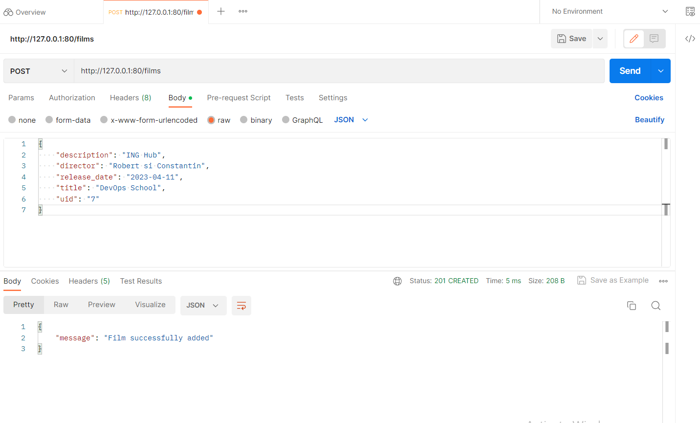
- **GET**
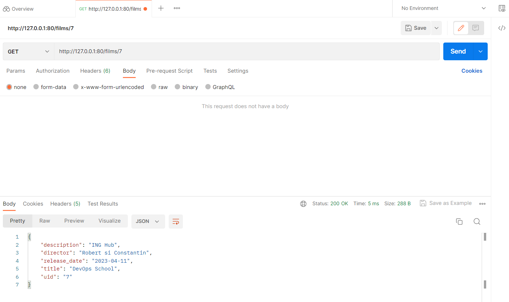
- **PUT**
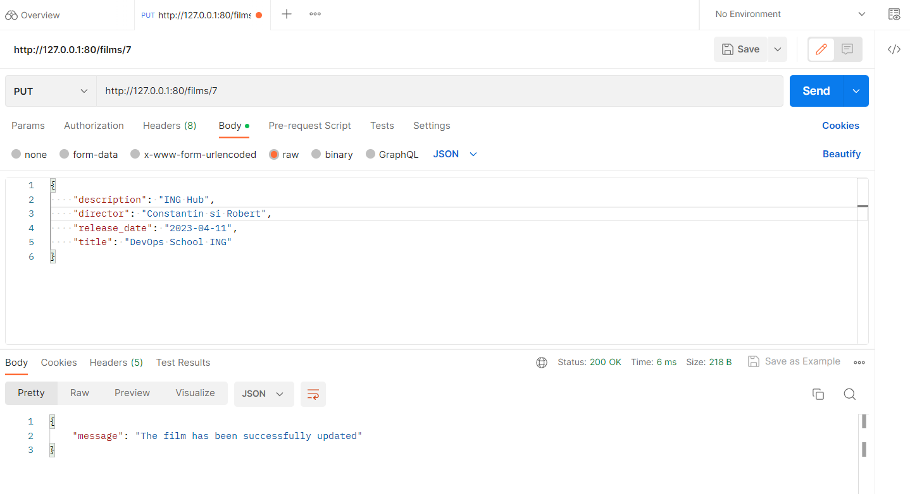
- **PATCH**
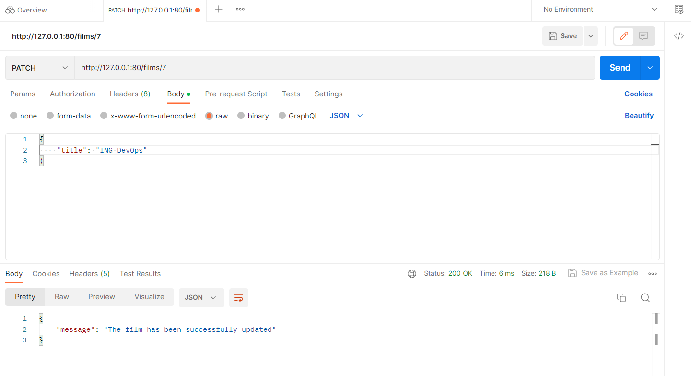
- **DELETE**
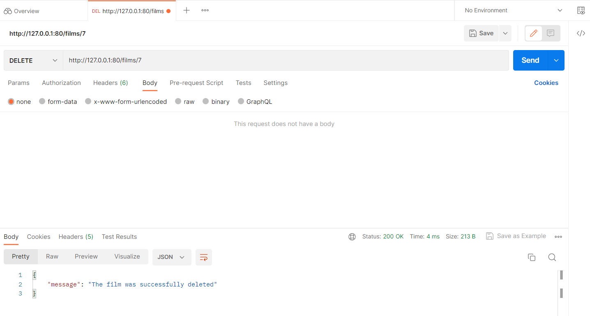

The **Dockerfile** contains all the instructions needed to create the Docker image and run the Flask application in a Docker container.

The Bash script (**pipeline.sh**) was developed to implement a CI/CD module locally. 

#### This Bash script works as following:

- **Builds the Docker image with the Flask application**
   - Command used to build the Docker image: `./pipeline.sh build --dockerFilePath=. --imageName=flaskapp2 --imageTag=latest`
   - Help command for the image build process: `./pipeline.sh build --help`

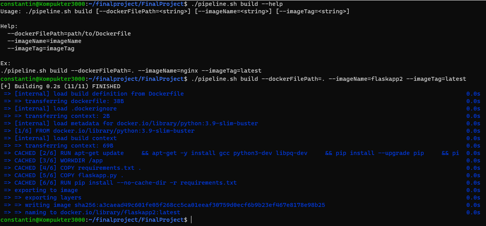

- **Pushes the created Docker image into a container registry**

   - Command used to push Docker image: `./pipeline.sh push --containerRegistryUsername=endofdaze --imageName=flaskapp2 --imageTag=latest`
   - Help command for image push process: `./pipeline.sh push --help`

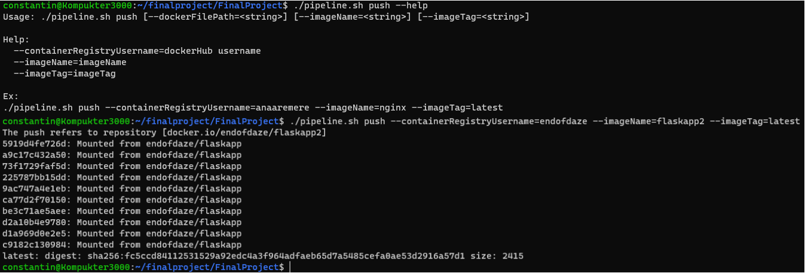

- **Deploys a container with the Flask application on the local machine using Docker**

   - Command used to deploy the container using Docker: `./pipeline.sh deploy --flavour=docker --imageName=flaskapp2 --imageTag=latest`
   - Help command for container deployment process: `./pipeline.sh deploy --help`

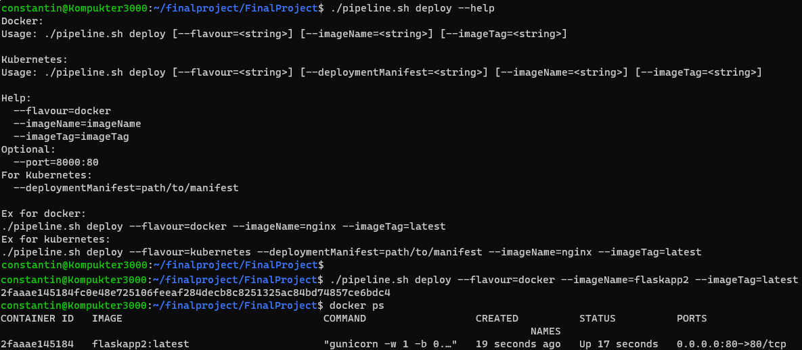

- **Tests the application by sending a curl request to the application's home page** 

   - Command used for testing the application: `./pipeline.sh test --endpoint=http://localhost/`
   - Help command for testing process: `./pipeline.sh test --help`

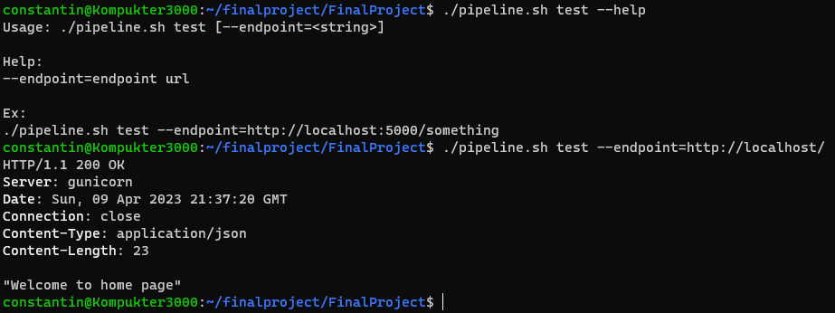

- **Creates a Kubernetes deployment with the Flask application in a Kubernetes cluster deployed on the local machine**

   - Commands used to perform the deployment and service using Kubernetes:
      - `./pipeline.sh deploy --flavour=kubernetes --deploymentManifest=manifests/deployment-manifest.yml --imageName=endofdaze/flaskapp2 --imageTag=latest`
      - `./pipeline.sh deploy --flavour=kubernetes --deploymentManifest=manifests/service-manifest.yml --imageName=endofdaze/flaskapp2 --imageTag=latest`

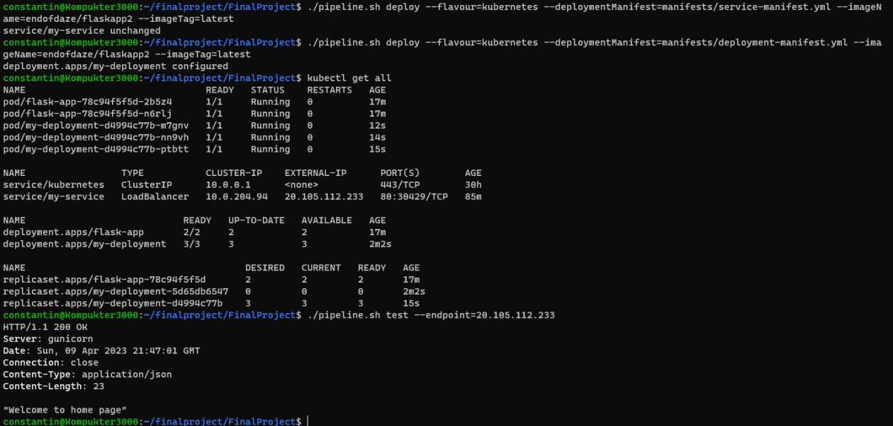

For the implementation of the CI/CD module in the Cloud, the Azure was used.

#### An Azure DevOps pipeline was created which:

- Builds the Docker image with the Flask application

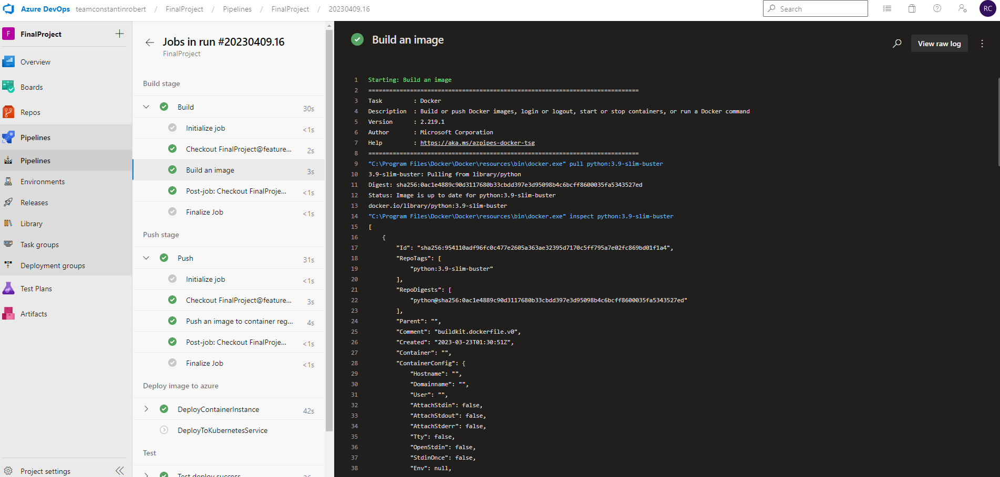
- Pushes the Docker image into the container registry created in Azure Portal 

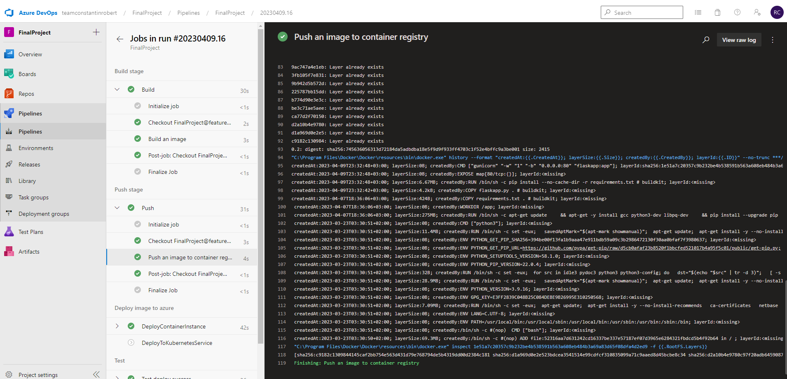
- Deploys the Flask application in two ways
   - Create a Container Instance and run the container with the Docker image there 
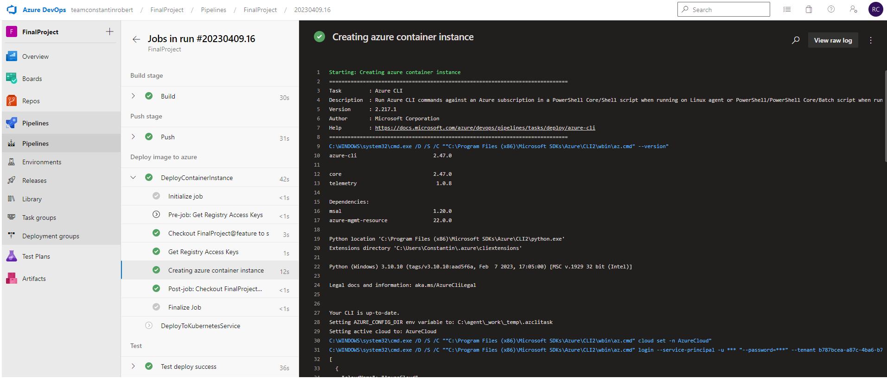
   - Create a Kubernetes deployment with the Flask app in a Kubernetes cluster
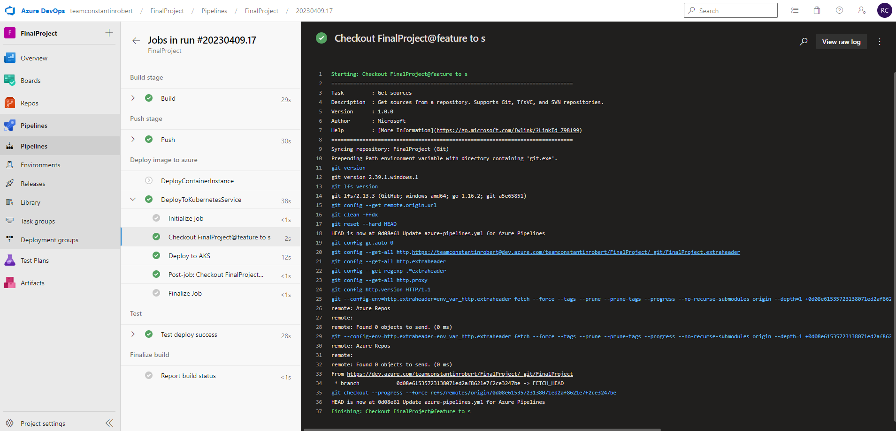
- Test the application by sending a curl request to the application's home page
   - Container Instance
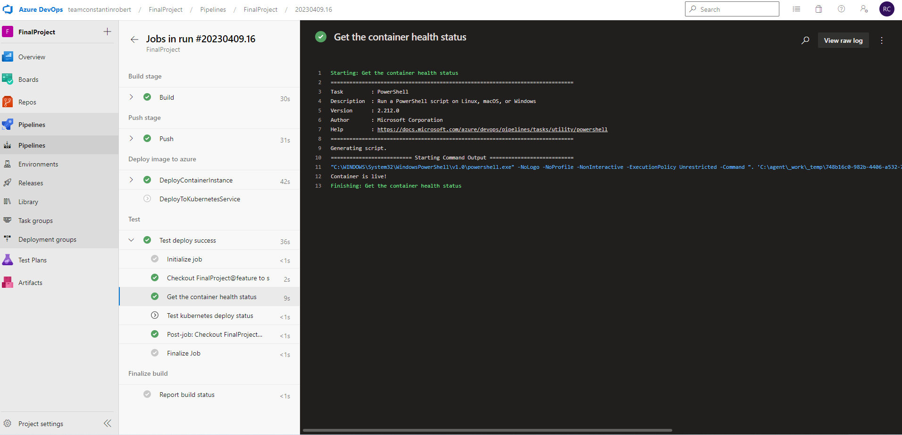
   - Kubernetes
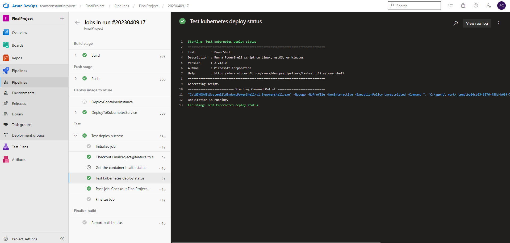
